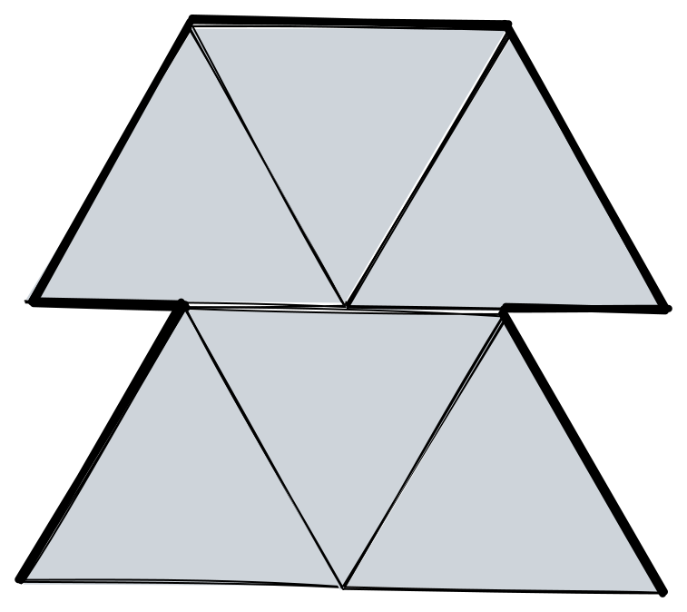
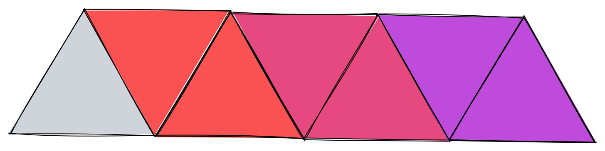
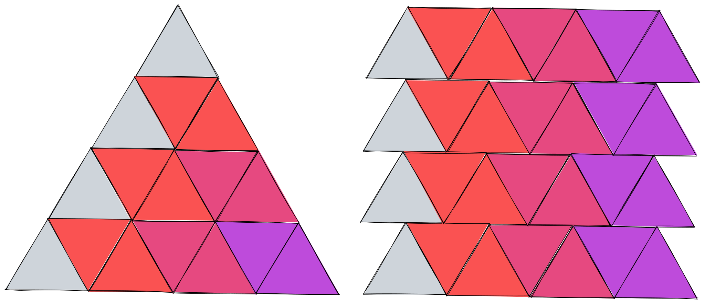

# Q3: Tri-Scapes

## Part A

i. An index can never contain consecutive ones.

**false**

Here's an example. All of the upside-down triangles are supported on the left and
right. It has the index `001100`.

> It's possible that this is not actually allowed, but it depends on the wording of the
> question. If "There must not be lines that are not part of a triangle." means that you
> can't have any outward-facing edges that aren't a whole side of a triangle, then I think
> this must be true?

ii. Indexes with n 0s may never contain more than (n - 1) 1s.

**true**

Each downward-facing triangle must be supported by an upward-facing triangle on each side,
but each upward-facing triangle can support up to two downward-facing triangles. In any
given row (or contiguous part of a row), the left-most and right-most upward-facing
triangles can only support one downward-facing triangle, so there must be at least n 0s
for every n-1 1s.

iii. The last character of an index is always a 0.

**true**

By definition, the last triangle cannot have anything to its right, so it cannot be
supported both on the left and the right.

iv. Columns exceeding a height of 1 must always end with an upwards pointing triangle.

**false**

Same reasoning as (i). Same problem with (i) if I've misunderstood the question.

## Part B

If my assumption in part A is correct, then:

`h * (t - 1)`

If my assumption in part A is incorrect, then you reduce the number of upside-down
triangles by 1 each time, assuming h <= t

`t - 1 + t - 2 + t - 3 ... + 1 = t(t-1)/2 - (t - h)(t - h - 1)/2`

## Part C

`0101010101010`

**1 (alternating triangles in a single row)**

For each upward facing triangle, you have a choice of whether to start a new column, or
to add to the existing column. If you add to the existing column, there's nowhere for the
following downward-facing trianglee to go.

